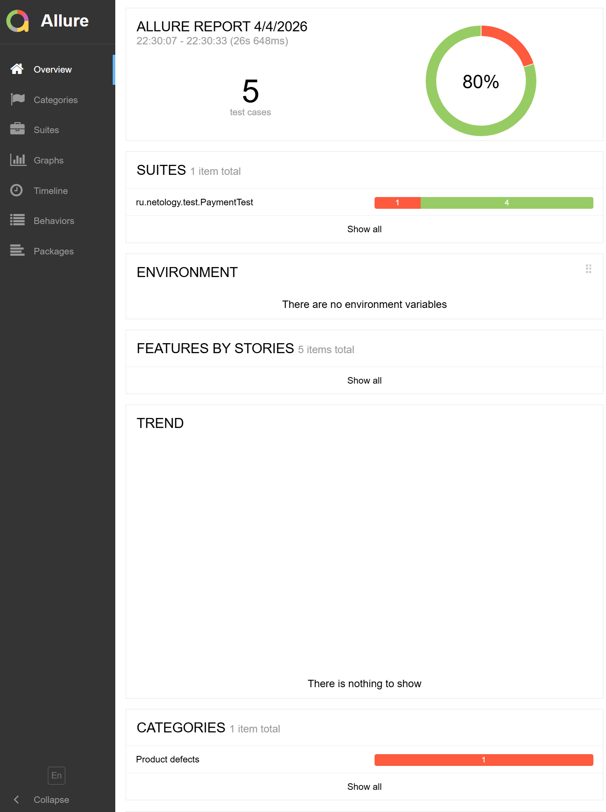

# Курсовой проект по модулю «Автоматизация тестирования» для профессии «Инженер по тестированию»

## Документация проекта
* **[План автоматизации](Plan.md)**
* **[Отчёт по итогам тестирования](Report.md)**

## О найденных багах
В ходе тестирования был обнаружен критический дефект бизнес-логики: система одобряет операции по картам со статусом `DECLINED`. Подробный баг-репорт заведен в разделе **Issues**. Динамический бейдж сборки выше загорается красным цветом именно из-за падения теста на данный баг.

## Результаты тестирования
Ниже представлен отчет Allure по результатам прогона 5 автотестов (4 позитивных и 1 негативный сценарий, выявивший баг):

